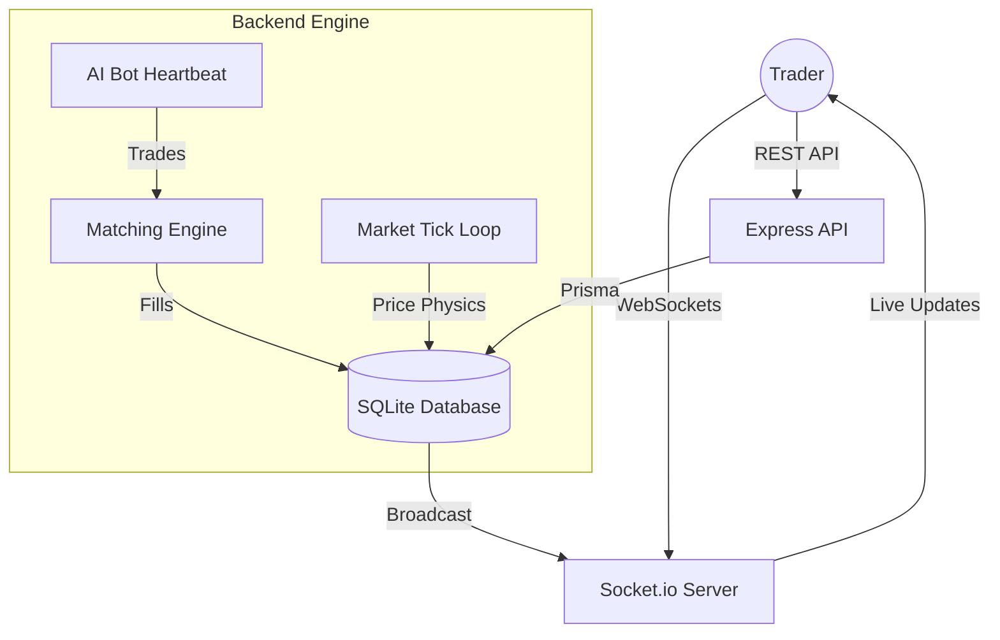

# 🏦 Yellow Ledger

> **A living, breathing exchange engine built for speed, transparency, and high-frequency chaos.**

Yellow Ledger is a full-stack trading simulator that transforms a simple market prototype into a sophisticated financial engine. It combines real-time WebSockets, autonomous AI bots, and a custom-built limit order book to create a marketplace that never sleeps.

---

## 🏗️ The Project Evolution
This project underwent a massive 4-phase backend modernization to move beyond standard CRUD patterns:
1.  **Persistence Overhaul:** Migrated from volatile JSON file storage to a relational **Prisma + SQLite** database with transaction safety.
2.  **Real-Time Core:** Implemented **Socket.io** to remove REST polling, enabling sub-100ms market updates across all connected clients.
3.  **Liquidity Provision:** Designed a **Heartbeat Engine** for autonomous AI bots (Whales, Algos) that trade against the user in real-time.
4.  **Matching Engine:** Developed an asynchronous **Limit Order Book** that evaluates and fills trades based on price-time priority.

---

## ✨ Core Features

### 🎮 The Gameplay
- **The Information Economy:** Don't just trade on charts. Buy **Rumors** to predict market events or pay for **Ad Campaigns** to pump the momentum of your own holdings.
- **Creator Studio:** Break through the $5,000 net worth threshold to publish your own custom cards, define their supply/volatility, and earn royalties on every subsequent trade.
- **Progression Loop:** Experience level-up mechanics, daily rewards, and global leaderboard rankings.

### ⚙️ The Engineering
- **Autonomous AI Market Makers:** Three distinct bot archetypes (Momentum, Whale, Retail) keep the market volatile even when you're offline.
- **Limit Order Matching:** Place targets for entries and exits; our background engine fills your orders the moment the AMM price hits your trigger.
- **Institutional Guardrails:** Real-time **Anomaly Detection** flags wash-trading, while **Circuit Breakers** automatically halt assets with extreme price spikes.

---

## 🛠️ Architecture Overview



---

## 🚀 Tech Stack

| Layer | Responsibility | Technology |
| :--- | :--- | :--- |
| **Frontend** | Reactive UI & Sparklines | React 19, Vite, TypeScript |
| **Real-time** | Low-latency state sync | Socket.io |
| **Backend** | API & Auth & Bot AI | Node.js, Express, tsx |
| **Database** | Relational Ledger & Audit | Prisma ORM, SQLite |
| **Security** | Input & Auth | Zod, JWT, Bcrypt |

---

## 🏁 Getting Started

### 1. Prerequisites
- Node.js (v18+)
- npm

### 2. Installation
```bash
git clone https://github.com/Anushreebasics/peel-exchange.git
cd peel-exchange
npm install
```

### 3. Database Sync
Yellow Ledger uses Prisma to manage its relational schema.
```bash
npx prisma db push
npx prisma generate
```

### 4. Running the Exchange
Start the frontend and backend concurrently in watch mode:
```bash
npm run dev
```
- **Trade Floor:** [http://localhost:5173](http://localhost:5173)
- **API Server:** [http://localhost:3001](http://localhost:3001)
- **WebSockets:** Binds successfully to PORT 3001](http://localhost:3001)

---

## 📡 API Endpoints

-   **Authentication:** `/api/auth/signup`, `/api/auth/login`
-   **Core Trading:** `/api/game/buy`, `/api/game/sell`, `/api/game/order` (Limit Orders)
-   **Insider Info:** `/api/game/rumor`, `/api/game/advertise`
-   **Admin/Debug:** `/api/debug/audit`, `/api/debug/anomalies`, `/api/debug/circuit-breakers`

---

## 📝 License
This project is open-source under the MIT License. Built with 🍌.
