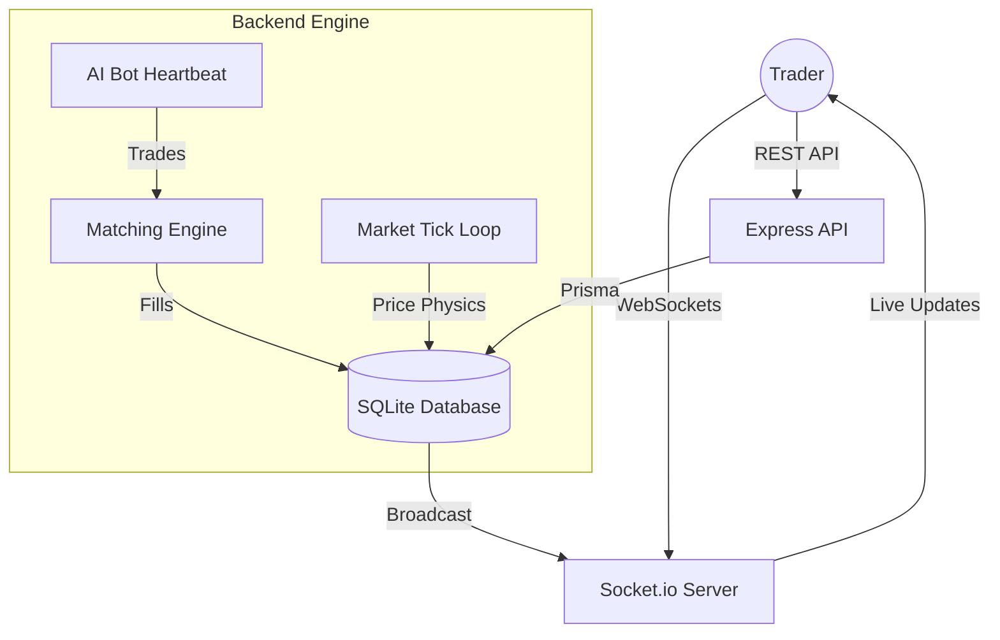

# Yellow Ledger

**The high-stakes trading simulator where the information is as valuable as the assets.**

Yellow Ledger is a full-stack trading game that puts you in the driver's seat of a high-frequency marketplace. Trade volatile assets, exploit insider rumors, launch aggressive marketing campaigns, and eventually build your own financial empire.

---

## The Game: How it Works

In Yellow Ledger, you start with **$1,500** and a dream. The market is live 24/7, driven by a heartbeat engine that simulates real-world supply and demand.

### Trading and Wealth
- **Market Orders:** Execute instant buys and sells against the automated liquidity pool.
- **Limit Orders:** Set your target price and let the background matching engine fill your orders while you're away.
- **Slippage and Fees:** Watch out for "Anti-Whale" measures. Large trades move the market and cost more in fees.

### The Information Economy
- **Rumor Mill:** Spend your cash to buy "Insider Tips." These hints give you a head-start on the next market event or price spike.
- **Ad Campaigns:** Once you own a position, you can pay to run marketing campaigns that temporarily boost an asset's momentum and demand bias.

### Creator Studio (The End Game)
Once you break the **$5,000 net worth** threshold, you unlock the status of a Market Maker:
- **Publish Assets:** Design your own tradeable cards with custom volatility and supply models.
- **Earn Royalties:** Every time another player (or a bot!) trades your asset, you collect a percentage of the fee directly into your creator wallet.

### Meet the Bots
You aren't trading alone. Three distinct AI archetypes live in the ledger:
- **Momentum Algos:** Trend-following bots that jump on green candles.
- **Whale Entities:** Deep-pocketed accounts that cause massive slippage and flash crashes.
- **Retail Swarms:** Highly reactive, emotional traders that respond to news headlines.

---

## The Engineering: Deep Dive

Yellow Ledger is more than just a game; it's a sophisticated financial engine designed to move beyond traditional CRUD patterns.

### 1. Real-Time Synchronization (Socket.io)
Traditional games use polling. Yellow Ledger uses a low-latency **WebSocket heartbeat**. Every 5 seconds, the server calculates new market physics and broadcasts a global `market_update` event to all connected clients simultaneously.

### 2. Relational State Management (Prisma + SQLite)
We migrated from simple JSON file storage to a robust relational database. This enables:
- **Transactional Integrity:** Prevents race conditions during rapid trades.
- **Cold Storage Sync:** The market state is persisted to SQLite via Prisma on every tick to ensure 100% data durability.

### 3. Asynchronous Matching Engine
The backend runs a constant evaluation loop for player **Limit Orders**. It uses a Price-Time priority model to check if the current AMM price overlaps with player targets, executing trades on their behalf without the client being active.

### 4. Institutional Guardrails
- **Anomaly Detection:** Real-time flagging of "Wash Trading" or suspicious price deviations.
- **Circuit Breakers:** Automatic trading halts on assets experiencing unpredicted volatility (Halted state).

---

## Internal Architecture



---

## Tech Stack

| Layer | Responsibility | Technology |
| :--- | :--- | :--- |
| **Frontend** | Reactive UI & Sparklines | React 19, Vite, TypeScript |
| **Sync** | Real-time low-latency updates | Socket.io |
| **Core** | API, Auth & Logic | Node.js, Express, tsx |
| **Persistence** | Relational Ledger & Audit | Prisma ORM, SQLite |
| **Security** | Input & Auth | Zod, JWT, Bcrypt |

---

## Getting Started

### 1. Installation
```bash
git clone https://github.com/Anushreebasics/yellow-ledger.git
cd yellow-ledger
npm install
```

### 2. Database Sync
```bash
npx prisma db push
npx prisma generate
```

### 3. Boot the Exchange
```bash
npm run dev
```
- **Trade Floor:** [http://localhost:5173](http://localhost:5173)
- **API Server:** [http://localhost:3001](http://localhost:3001)

---

## License
This project is open-source under the MIT License.
